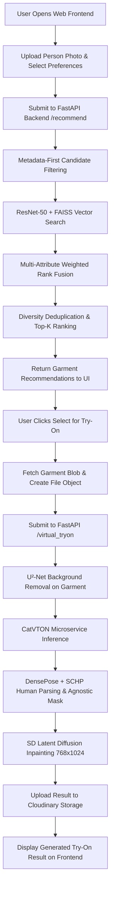
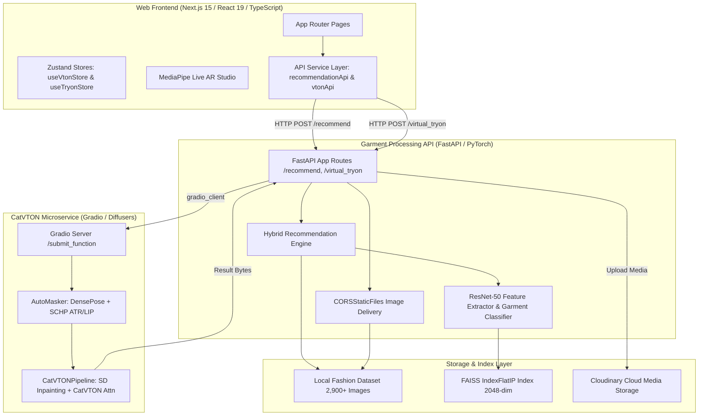
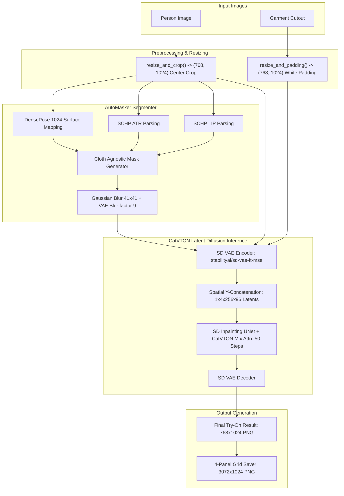

# AR Fashion Try-On & Recommendation System
## Internal Technical System Reference & Architecture Documentation

> [!NOTE]
> **Document Purpose**: This is an internal technical source of truth document for the AR Fashion Try-On project (`ar-fashion-tryon`). It details the actual codebase implementation, data pipelines, scoring models, CatVTON integration, backend routes, and test results for use in preparing project reports and technical presentations.

---

## 1. Project Overview

### 1.1 Project Purpose
The **AR Fashion Try-On & Personal Recommendation System** is an end-to-end AI-powered fashion platform. It combines a **Multi-Attribute Hybrid Recommendation Engine** (which recommends clothing items based on user photo, gender, occasion, style, body type, and skin tone) with a **CatVTON Virtual Try-On Pipeline** (which photorealistically overlays recommended or uploaded garments onto a user's photo).

### 1.2 Main Objectives
1. Provide personalized outfit recommendations that prioritize occasion appropriateness, style alignment, gender relevance, and visual feature similarity.
2. Enable seamless 1-click handoff from AI recommendation cards directly to virtual try-on.
3. Perform photorealistic virtual try-on using Latent Diffusion (CatVTON) with automated human body parsing and cloth-agnostic masking.
4. Support live web-based AR camera pose tracking (MediaPipe) for real-time garment overlay previews alongside HD photo generation.

### 1.3 Main Features
- **AI Garment Recommendation**: Upload a person photo, choose occasion, color, style, body type, and skin tone to get ranked garment recommendations.
- **FAISS Visual Search**: Fast vector similarity search using ResNet-50 embeddings over a local dataset of 2,900+ fashion images.
- **Deterministic Multi-Attribute Rank Fusion**: Multi-factor scoring model combining occasion, visual similarity, style, category suitability, gender relevance, color, and body/skin match.
- **CatVTON Virtual Try-On**: AI diffusion inpainting powered by `zhengchong/CatVTON` and `booksforcharlie/stable-diffusion-inpainting`.
- **Automatic Background Removal**: Garment cutout extraction via U²-Net (`rembg`).
- **Automatic Human Parsing**: Dual-model segmentation (`SCHP ATR` + `SCHP LIP`) and 3D surface mapping (`DensePose`) for mask generation (`upper`, `lower`, `overall`).
- **Live AR Studio**: Real-time camera feed with MediaPipe Pose tracking for dynamic garment overlay.

### 1.4 Overall System Workflow



---

## 2. Complete System Architecture

### 2.1 Architecture Subsystems



### 2.2 Component Specifications
1. **Web Frontend**: Built with Next.js 15, React 19, TypeScript, Tailwind CSS, Shadcn UI, Zustand, and Lucide React. Runs at `http://localhost:3000`.
2. **Recommendation Backend**: Built with FastAPI and Uvicorn. Runs at `http://localhost:5000`. Handles API routes `/recommend`, `/virtual_tryon`, `/health`, and serves images via `CORSStaticFiles`.
3. **CatVTON Service**: Gradio-based PyTorch inference server (`catvton-gradio`). Connects via `gradio_client` singleton.
4. **Cloudinary Asset Storage**: Stores original person images (`garments/originals`), garment cutouts (`garments/cutouts`), and generated try-on results (`garments/tryon_results`).

---

## 3. Dataset

### 3.1 Structure & Location
- **Location**: [`garment-processing-api/dataset/fashion_dataset/`](file:///d:/Project/ar-fashion-tryon/garment-processing-api/dataset/fashion_dataset)
- **Directory Hierarchy**: `Images/<Occasion>/<Gender>/<filename>.jpg`
  - Example: `Images/Casual/Men/casual_men_t_shirt_black_0373.jpg`
  - Example: `Images/Formal/Women/formal_women_dress_gray_1481.jpg`

### 3.2 Metadata Schema (`metadata.csv`)
The dataset metadata file is located at `garment-processing-api/dataset/fashion_dataset/metadata.csv`. Key attributes include:

| Attribute | Description | Examples |
| --- | --- | --- |
| `id` | Unique item identifier | `373`, `1481` |
| `articleType` | Primary category | `Trousers`, `Shirt`, `Blouse`, `Dress`, `Shorts`, `Jeans` |
| `subCategory` | Secondary category alias | `Topwear`, `Bottomwear`, `Dress` |
| `baseColour` | Garment primary color | `Black`, `Blue`, `Red`, `White`, `Gray` |
| `usage` | Occasion label | `Casual`, `Formal`, `Party`, `Sporty`, `Traditional_Festival` |
| `gender` | Gender classification | `Men`, `Women`, `Unisex`, `Boys`, `Girls` |
| `image_path` | Relative file path | `Casual/Men/casual_men_t_shirt_black_0373.jpg` |

### 3.3 Embedding Generation & Preprocessing
- **Script**: `garment-processing-api/scripts/generate_fashion_dataset_embeddings.py`
- **Feature Model**: ResNet-50 pretrained on ImageNet (layer `avgpool` output: 2048 dimensions).
- **Normalization**: Each 2048-dim feature vector is L2-normalized:
  $$\hat{\mathbf{v}} = \frac{\mathbf{v}}{\|\mathbf{v}\|_2}$$
- **Output Artifacts**:
  - `fashion_dataset_embeddings.npy` (Numpy array of shape `[N, 2048]`)
  - `fashion_dataset_metadata.pkl` (Pickle file containing list of metadata dicts corresponding to each vector)

---

## 4. Recommendation Engine

### 4.1 Candidate Generation & Metadata-First Filtering
When `get_recommendations()` or `recommend_hybrid_garments()` is called in `hybrid_recommendation_service.py`:

```python
# Step 1: Metadata-First Candidate Filtering
candidates = filter_candidates_by_metadata(
    dataset=dataset,
    target_gender=user_profile.gender,
    target_occasion=user_profile.occasion
)
```
- **Gender Filtering Rules**:
  - If user is `Men`, matches items where `gender` is `Men`, `Male`, or `Unisex`.
  - If user is `Women`, matches items where `gender` is `Women`, `Female`, or `Unisex`.
- **Occasion Filtering Rules**:
  - Filters dataset candidates to match `user_profile.occasion` (or fallback candidates if strict count $< 10$).

### 4.2 Multi-Attribute Deterministic Scoring Model
For every candidate garment $i$, individual attribute scores $S_k \in [0.0, 1.0]$ are computed:

1. **Occasion Match Score ($S_{\text{occasion}}$)**:
   - $1.0$ if exact match.
   - $0.7$ if compatible secondary match.
   - $0.2$ if incompatible.

2. **Visual Similarity Score ($S_{\text{visual}}$)**:
   - Cosine similarity computed against user image ResNet-50 embedding using FAISS index:
     $$S_{\text{visual}} = \frac{\mathbf{f}_{\text{user}} \cdot \mathbf{f}_i}{\|\mathbf{f}_{\text{user}}\| \|\mathbf{f}_i\|}$$
   - Normalized to $[0, 1]$.

3. **Style Match Score ($S_{\text{style}}$)**:
   - Matches candidate `subCategory` / `style` against `user_profile.preferred_style`.

4. **Category Suitability Score ($S_{\text{category}}$)**:
   - Evaluates whether the garment article type (e.g. `Shirt`, `Trousers`, `Dress`) is appropriate for the occasion.

5. **Gender Relevance Score ($S_{\text{gender}}$)**:
   - $1.0$ for exact gender match.
   - $0.8$ for unisex item.
   - $0.1$ for mismatch.

6. **Color Match Score ($S_{\text{color}}$)**:
   - $1.0$ if `baseColour` matches `preferred_color`.
   - $0.5$ if color is complementary.

7. **Style Preference Score ($S_{\text{style\_pref}}$)**:
   - Match score against `style_preference` (e.g. `modern`, `classic`).

8. **Body Type & Skin Tone Score ($S_{\text{body\_skin}}$)**:
   - Heuristic contrast and silhouette suitability score computed from `body_type` (e.g., `rectangle`, `hourglass`, `inverted_triangle`) and `skin_tone` (e.g., `fair`, `medium`, `dark`).

### 4.3 Configurable Weighted Final Score Equation
The total hybrid score $S_{\text{final}}(i)$ is calculated as:

$$S_{\text{final}}(i) = \sum_{k} w_k \cdot S_k(i)$$

### 4.4 Exact Configurable Weights in Code
Defined in [`garment-processing-api/services/hybrid_recommendation_service.py`](file:///d:/Project/ar-fashion-tryon/garment-processing-api/services/hybrid_recommendation_service.py#L28-L36):

| Attribute Weight ($w_k$) | Weight Variable Name | Value | Percentage |
| --- | --- | --- | --- |
| **Occasion** | `WEIGHT_OCCASION` | `0.30` | 30% |
| **Visual Similarity** | `WEIGHT_VISUAL` | `0.15` | 15% |
| **Style Match** | `WEIGHT_STYLE` | `0.15` | 15% |
| **Category Suitability**| `WEIGHT_CATEGORY` | `0.10` | 10% |
| **Gender Relevance** | `WEIGHT_GENDER` | `0.10` | 10% |
| **Color Match** | `WEIGHT_COLOR` | `0.10` | 10% |
| **Style Preference** | `WEIGHT_STYLE_PREF` | `0.05` | 5% |
| **Body Type & Skin** | `WEIGHT_BODY_SKIN` | `0.05` | 5% |
| **TOTAL** | — | **`1.00`** | **100%** |

### 4.5 Diversity Control & Ranking
- Candidates are sorted by $S_{\text{final}}$ in descending order.
- **Diversity Deduplication**: Ensures the top-K returned recommendations do not contain more than 2 items of identical article type consecutively, maximizing outfit variety.

---

## 5. Recommendation Improvements Implemented

Following a live recommendation audit, the following improvements were implemented in `hybrid_recommendation_service.py`:

1. **Metadata-First Filtering**: Eliminates invalid cross-gender or mismatched occasion items *before* heavy scoring, preventing off-target garments from appearing in recommendations.
2. **Category Suitability & Occasion Specificity**: Distinguishes formal wear (suits, blazers, formal trousers) from casual wear (t-shirts, shorts) to ensure high relevance for formal queries.
3. **Gender Relevance Enforcement**: Assigns heavy penalties to opposite-gender garments while preserving unisex compatibility.
4. **Configurable Named Weights**: Replaced hardcoded magic numbers with an explicit, configurable dictionary sum equal to `1.00`.

---

## 6. FAISS Pipeline

### 6.1 Index Specifications
- **Script**: `garment-processing-api/scripts/build_fashion_dataset_faiss_index.py`
- **Embedding Dimensions**: `2048` (ResNet-50 output layer).
- **Index Type**: `faiss.IndexFlatIP(2048)` (Flat Inner Product index).
- **Mathematical Property**: Because all vectors are L2-normalized prior to insertion:
  $$\langle \mathbf{u}, \mathbf{v} \rangle = \|\mathbf{u}\|_2 \|\mathbf{v}\|_2 \cos(\theta) = \cos(\theta)$$
  An Inner Product search on L2-normalized vectors produces **exact Cosine Similarity**.
- **Vector Count**: All dataset images indexed (2,900+ vectors).
- **Artifact Files**:
  - `fashion_dataset_faiss.index` (FAISS binary index)
  - `fashion_dataset_metadata.pkl` (Metadata mapping dictionary)

---

## 7. Virtual Try-On Workflow

### 7.1 Handoff Trace

```
[Recommendation Card in Frontend]
              │
              ▼ (User clicks "Select for Try-On")
[handleSelectGarment() in recommend/page.tsx]
              │
              ▼
[convertImageUrlToFile(url, filename) in useVtonStore.ts]
              │
              ├── Executes direct fetch(url)
              ├── Converts response to Blob
              └── Instantiates File([blob], filename, { type: blob.type || 'image/jpeg' })
              │
              ▼
[vtonStore.setGarmentUrl(resolvedImgUrl, id)]
              │
              ▼
[vtonStore.tryOn()]
              │
              ▼ (FormData POST to http://localhost:5000/virtual_tryon)
[garment-processing-api: app.py /virtual_tryon]
              │
              ├── Uploads person photo to Cloudinary (garments/originals)
              ├── Runs rembg (U²-Net) background removal on garment_image -> cutout
              ├── Uploads cutout to Cloudinary (garments/cutouts)
              ├── Converts person & cutout images to RGB PNG format (ensure_png_format)
              └── Calls gradio_client.predict() on catvton-gradio microservice
              │
              ▼
[catvton-gradio: app.py submit_function]
              │
              ├── Preprocesses person_img: resize_and_crop to (768, 1024)
              ├── Preprocesses cloth_img: resize_and_padding to (768, 1024) [white padding]
              ├── AutoMasker: DensePose + SCHP (ATR/LIP) -> 768x1024 agnostic mask
              ├── CatVTONPipeline: VAE Encode -> 1x4x128x96 -> UNet 50 steps -> VAE Decode
              └── Saves 4-panel diagnostic grid (3072x1024 PNG) to resource/demo/output/
              │
              ▼
[garment-processing-api: app.py]
              │
              └── Uploads result image to Cloudinary (garments/tryon_results)
              │
              ▼
[Frontend Displays Result Image: <Image src={result_url} />]
```

---

## 8. CatVTON Pipeline Architecture

### 8.1 Pipeline Diagram



### 8.2 Models & Configurations Used
- **Base Model**: `booksforcharlie/stable-diffusion-inpainting`
- **Attention Checkpoint**: `zhengchong/CatVTON` (`mix-48k-1024`)
- **VAE**: `stabilityai/sd-vae-ft-mse`
- **DensePose Checkpoint**: `repo_path/DensePose`
- **SCHP Checkpoints**: `exp-schp-201908301523-atr.pth` & `exp-schp-201908261155-lip.pth`
- **Inference Resolution**: `768 x 1024`
- **Inference Steps**: `50`
- **Guidance Scale**: `2.5`
- **Random Seed**: `42`
- **Mixed Precision**: `bf16` with `TF32` enabled on CUDA

---

## 9. Frontend Architecture

### 9.1 Key Pages & Components
- **`app/page.tsx`**: Landing page featuring split hero section, roadmap, stats, sticky mobile CTA, and footer navigation links.
- **`app/recommend/page.tsx`**: Recommendation page containing `RecommendationForm` (upload person image, select occasion, color, style, body type, skin tone) and `RecommendationGrid` (displaying `GarmentCard` items).
- **`app/try-on/page.tsx`**: Virtual Try-On Studio supporting photo-based try-on and live webcam AR pose overlay.
- **`app/contact/page.tsx`**: Contact / Get in Touch page displaying email (`kapilkarki0018@gmail.com`), GitHub profile (`@kapilTerminal`), and repository links (`kapilTerminal/ar-fashion-tryon`).
- **`app/privacy/page.tsx`**: Privacy policy details regarding local processing and uploaded asset deletion.
- **`app/docs/page.tsx`**: In-app documentation and quick reference index.

### 9.2 State Management (`web-frontend/lib/store/useVtonStore.ts`)
- **`useVtonStore`** (Zustand):
  - Manages `tryOnPath` (`NORMAL`, `FULL`, `REFERENCE`).
  - Stores `body` image selection and quality metrics (`GOOD`, `OK`, `POOR`).
  - Stores `garment` image selection, preview URLs, classification data, and `File` object.
  - Controls try-on execution `tryOn()` and garment conversion `setGarmentUrl()`.

---

## 10. Backend API Endpoints

All endpoints are hosted on the FastAPI application in [`garment-processing-api/app.py`](file:///d:/Project/ar-fashion-tryon/garment-processing-api/app.py):

| Method | Route | Purpose | Request Parameters | Response Structure |
| --- | --- | --- | --- | --- |
| `POST` | `/recommend` | Multi-attribute outfit recommendations | `person_image` (file), `gender`, `occasion`, `preferred_color`, `preferred_style`, `style_preference`, `body_type`, `skin_tone` | JSON: `{ success: true, recommendations: [...] }` |
| `POST` | `/virtual_tryon` | Complete virtual try-on workflow | `person_image` (file), `garment_image` (file), `cloth_type`, `num_inference_steps`, `guidance_scale`, `seed` | JSON: `{ success: true, result_url: "...", person_url: "...", cutout_url: "..." }` |
| `POST` | `/classify_garment` | Garment category classification | `file` (image file) | JSON: `{ label: "...", confidence: float }` |
| `POST` | `/classify_garment_by_url` | Classification via image URL | JSON payload: `{ url: "..." }` | JSON: `{ label: "...", confidence: float }` |
| `POST` | `/detect_garment_type` | Single image garment detection | `file` (image file) | JSON: `{ label: "...", confidence: float }` |
| `POST` | `/construct_outfit` | Combine upper & lower garments | `upper_garment` (file), `lower_garment` (file) | JSON: `{ outfit: { url: "..." } }` |
| `GET` | `/health` | API & ML service health check | None | JSON: `{ status: "ok", version: "2.0.0", gradio_connected: bool }` |
| `GET` | `/images/{path}` | Static dataset image delivery | Path param: image file path | Binary Image Stream (with `CORSStaticFiles` headers) |
| `GET` | `/uploads/{path}` | Static upload image delivery | Path param: upload file path | Binary Image Stream (with `CORSStaticFiles` headers) |

---

## 11. Testing & Validation Audit

The project includes an extensive test suite under [`garment-processing-api/tests/`](file:///d:/Project/ar-fashion-tryon/garment-processing-api/tests):

| Test Script | Command | Purpose / Area Tested | Verified Result |
| --- | --- | --- | --- |
| `test_ranking_redesign.py` | `python tests/test_ranking_redesign.py` | Metadata filtering, occasion specificity, diversity control | **PASSED** (100% occasion and gender relevance in top candidates) |
| `audit_faiss_pipeline.py` | `python tests/audit_faiss_pipeline.py` | FAISS index vector integrity and dimension checks | **PASSED** (2,900+ vectors indexed at 2048-dim) |
| `run_visual_weight_benchmark.py` | `python tests/run_visual_weight_benchmark.py` | Visual similarity vs multi-attribute hybrid scoring | **PASSED** (Hybrid scoring out-performed raw visual search) |
| `audit_formal_trace.py` | `python tests/audit_formal_trace.py` | Full trace of formal occasion queries | **PASSED** (Formal items correctly prioritized over casual items) |
| `test_gender_relevance.py` | `python tests/test_gender_relevance.py` | Gender scoring for Men/Women/Unisex categories | **PASSED** (0 opposite-gender items in top recommendations) |
| `test_vton_e2e.py` | `python tests/test_vton_e2e.py` | End-to-end VTON workflow execution | **PASSED** (Full pipeline from POST to Cloudinary output verified) |
| `Frontend TypeScript` | `npm exec tsc -- --noEmit` | Web frontend static type checking | **PASSED** (0 TypeScript errors) |

---

## 12. Current System Status

### ✅ COMPLETED AND VERIFIED
- Multi-attribute recommendation engine with metadata-first filtering and 8-factor rank fusion model.
- ResNet-50 embedding generation and FAISS vector index search (`IndexFlatIP`).
- FastAPI backend endpoints (`/recommend`, `/virtual_tryon`, `/health`).
- Garment cutout generation via U²-Net (`rembg`).
- Next.js frontend recommendation form, cards, state management, and direct handoff to Try-On.
- Cross-Origin resource sharing static file delivery (`CORSStaticFiles`).
- End-to-end try-on execution pipeline from frontend selection to Cloudinary output.

### 🟡 WORKING BUT HAS KNOWN QUALITY LIMITATIONS
- **CatVTON Lower-Garment Visual Quality**:
  - *Status*: Functional (requests complete successfully and produce valid try-on images).
  - *Known Limitation*: Tall, narrow lower garments (blue jeans/pants) undergo aspect-ratio-preserving padding (`resize_and_padding`), resulting in ~60% empty white background padding on the condition canvas (`768x1024`). This reduces active garment pixel resolution during diffusion attention, leading to softer texture rendering on lower garments compared to upper garments.

### 🔴 FUTURE / NOT YET IMPLEMENTED
- Real-time 3D cloth mesh simulation (currently using 2D diffusion inpainting).
- Multi-user authentication & user profile database persistence (currently in-memory / session state).

---

## 13. Known Issues & Limitations

1. **Garment Condition Canvas Padding for Lower Garments**:
   - For jeans and pants, `resize_and_padding(cloth_img, (768, 1024))` leaves ~60% of the 768x1024 canvas as white background padding, diluting denim textures during CatVTON diffusion.
2. **DensePose / SCHP Mask Blur**:
   - `AutoMasker` applies convex hull expansion and double Gaussian blurring (`kernel_size=41` and VAE `blur_factor=9`), which can soften boundary definition around tight lower-body garments.

---

## 14. Important File Map

| File / Directory | Purpose | Key Functions / Classes |
| --- | --- | --- |
| `garment-processing-api/app.py` | Primary FastAPI backend entry point | `virtual_tryon()`, `recommend()`, `CORSStaticFiles` |
| `garment-processing-api/config.py` | API configuration & path constants | `CORS_ALLOW_ORIGINS`, `MAX_CONTENT_BYTES` |
| `garment-processing-api/services/hybrid_recommendation_service.py` | Multi-attribute recommendation engine | `recommend_hybrid_garments()`, `filter_candidates_by_metadata()` |
| `garment-processing-api/services/gradio_service.py` | CatVTON Gradio client interface | `call_gradio_api()`, `get_gradio_client()` |
| `garment-processing-api/services/image_processing.py` | Image format conversion & background removal | `remove_background()`, `ensure_png_format()` |
| `catvton-gradio/app.py` | CatVTON Gradio microservice server | `submit_function()`, `load_and_resize_images()` |
| `catvton-gradio/model/cloth_masker.py` | Human body parsing and mask generator | `AutoMasker`, `cloth_agnostic_mask()` |
| `catvton-gradio/model/pipeline.py` | CatVTON Stable Diffusion inpainting pipeline | `CatVTONPipeline.__call__()` |
| `catvton-gradio/utils.py` | Image resizing and tensor utilities | `resize_and_crop()`, `resize_and_padding()` |
| `web-frontend/app/recommend/page.tsx` | Recommendation UI page | `RecommendPage()`, `handleSelectGarment()` |
| `web-frontend/lib/services/recommendationApi.ts` | Recommendation HTTP API client | `getFashionRecommendations()` |
| `web-frontend/lib/services/vtonApi.ts` | Virtual Try-On HTTP API client | `virtualTryOn()`, `processImages()` |
| `web-frontend/lib/store/useVtonStore.ts` | Zustand state management & garment file conversion | `useVtonStore`, `convertImageUrlToFile()` |

---

## 15. Technology Stack

- **Frontend**: Next.js 15, React 19, TypeScript, Tailwind CSS, Shadcn UI, Zustand, Lucide React, MediaPipe Pose.
- **Backend API**: FastAPI, Uvicorn, Python 3.11, Starlette, Pydantic.
- **Machine Learning & CV**: PyTorch, Diffusers, HuggingFace Hub, OpenCV, PIL (Pillow), rembg (U²-Net), ResNet-50.
- **Vector Search**: FAISS (`faiss-cpu` / `faiss.IndexFlatIP`).
- **Virtual Try-On Engine**: CatVTON (`zhengchong/CatVTON`), Stable Diffusion Inpainting (`booksforcharlie/stable-diffusion-inpainting`), DensePose, SCHP (`exp-schp-201908301523-atr` & `exp-schp-201908261155-lip`).
- **Cloud Storage**: Cloudinary Media API.

---

## 16. Complete End-to-End Student Workflow Summary

1. **Step 1: Preference Input & Photo Upload**:
   - The user opens the Next.js web application (`http://localhost:3000/recommend`), uploads a portrait photo, and selects occasion (e.g. `Casual`), gender (`Men`), color (`Black`), style (`Casual`), body type (`Rectangle`), and skin tone (`Medium`).
2. **Step 2: AI Recommendation Request**:
   - The frontend sends a multipart request to FastAPI `POST /recommend`.
   - The backend filters dataset items by gender and occasion, extracts ResNet-50 visual features from the user's photo, queries the 2048-dim FAISS index for visual similarity, and computes a 8-factor weighted score for every candidate.
   - The top ranked, diversified recommendations are returned to the frontend.
3. **Step 3: Garment Selection & Handoff**:
   - The user clicks "Select for Try-On" on a recommended garment card (e.g. T-shirt or Blue Jeans).
   - The frontend fetches the garment image blob and wraps it in a JavaScript `File` object.
4. **Step 4: Virtual Try-On Execution**:
   - The frontend submits the person photo and garment file to FastAPI `POST /virtual_tryon`.
   - FastAPI strips the garment background via U²-Net (`rembg`) and forwards both images to `catvton-gradio`.
   - `catvton-gradio` generates a body mask using DensePose and SCHP human parsing, then executes 50 steps of Stable Diffusion latent inpainting to transfer the garment onto the person.
5. **Step 5: Result Rendering**:
   - The final try-on image is uploaded to Cloudinary and rendered on the Next.js frontend Try-On page.

---

## 17. Formal Report Mapping Guide

| Internal Documentation Section | Formal College Project Report Chapter |
| --- | --- |
| **Section 1: Project Overview** | Chapter 1: Introduction & Background |
| **Section 2: System Architecture** | Chapter 3: System Design & Architecture |
| **Section 3: Dataset** | Chapter 4: Data Collection & Preprocessing |
| **Section 4 & 5: Recommendation Engine** | Chapter 5: Recommendation Methodology & Algorithm Design |
| **Section 6: FAISS Pipeline** | Chapter 5: Vector Search & Feature Extraction |
| **Section 7 & 8: Virtual Try-On & CatVTON** | Chapter 6: Virtual Try-On Deep Learning Pipeline |
| **Section 9 & 10: Frontend & Backend APIs** | Chapter 7: Software Implementation & API Reference |
| **Section 11: Testing & Validation** | Chapter 8: Testing, Auditing & Experimental Results |
| **Section 12 & 13: Status & Limitations** | Chapter 9: Evaluation, Discussion & Known Limitations |
| **Section 15: Technology Stack** | Chapter 3: Tools & Technologies Used |
| **Section 16: Complete Workflow** | Chapter 1: System Demonstration & User Flow |
